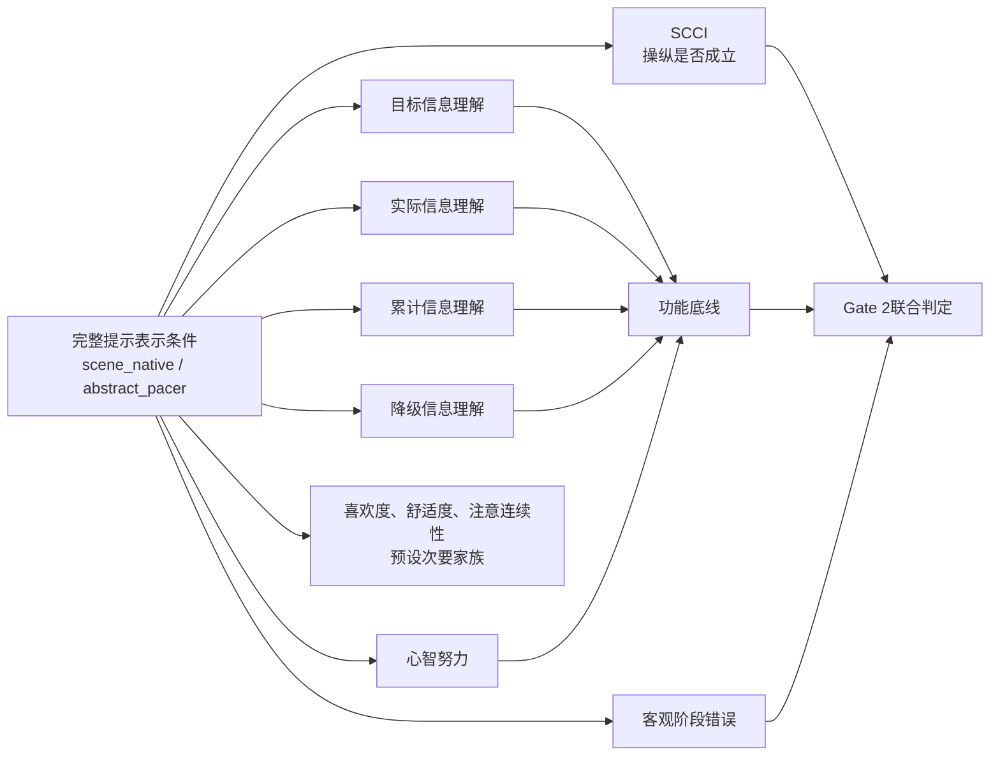

# F-02 Gate 2构念与测量深度研究包 v0.9-candidate

> 任务状态：`DONE`（候选材料与审查方案已交付）
>
> 研究状态：`REJECT_AND_RESUBMIT_DESIGN` / `PLANNED_NOT_OBSERVED`
>
> 材料状态：`CANDIDATE_NOT_LEVEL_AB_VALIDATED`
>
> 日期：2026-08-06

## 1. 任务边界与来源

本包完成F-02要求的构念图、SCCI操纵检查候选、条件中性四层理解题、心智努力候选、项目功能差异计划、专家审查表、两条件认知访谈提纲、目的猜测和修改日志。它为Level A/B提供可执行输入，不代表Level A/B已完成，也不关闭Gate 2、U1或U5。

外部输入为`C:\Users\fujunye\Downloads\deep-research-report.md`，SHA-256为`E0D5883163227B60F144085FF250F9A8E4D09A7562CC6EB5244D4CE60E05AB01`。该文件是研究摘要，其中指向完整包的隔离环境路径不可访问，内部会话引用也不能作为项目证据。本包仅吸收可复核的设计建议，并用可访问的一手或方法来源重新建立依据。

## 2. 构念与因果角色

| 构念 | 操作定义 | 在Gate 2中的职责 | 明确不承担 |
|---|---|---|---|
| SCCI | 提示是否被感知为场景自身表达的一部分 | 检查两条件的完整表示差异是否被感知 | 不单独证明表示价值、理解改善或总体效果 |
| 四层理解 | 对目标、实际、累计、降级四类信息的辨认与解释 | 形成条件中性的功能底线 | 不评价画面偏好、舒适度或审美质量 |
| 心智努力 | 理解、判断、记住并跟随提示所投入的主观认知资源 | 形成第二个功能底线 | 不评价身体用力、喜欢程度或舒适程度 |
| 客观阶段错误 | 按事件真值计算的阶段识别或跟随错误 | 防止主观理解得分掩盖行为层恶化 | 不替代四层理解或心智努力 |
| 次要体验家族 | 注意连续性、喜欢度、舒适度等预设指标 | 解释性补充并统一控制FDR | 不参与主要Gate补偿 |

## 3. Gate 2有序判定

Gate 2必须按下列顺序执行，不得用后面的有利结果补偿前面的失败：

1. **工具适用前提**：Level A确认内容覆盖、可理解性与构念边界；Level B确认两条件认知过程、用时和项目功能。未满足时，Gate 2不得进入正式判定。
2. **操纵成立**：`scene_native`相对`abstract_pacer`的SCCI方向与预注册假设一致。SCCI失败表示预期表示差异未被可靠感知。
3. **理解非劣**：四层理解总分及预设关键层满足非劣界限。非劣界限必须在查看条件效果前依据Level结果、量尺精度和实际意义冻结。
4. **心智努力非劣**：心智努力满足预设非劣界限；方向按分数越低越省力编码。
5. **客观防护**：客观阶段错误不得达到预设恶化条件。
6. **联合结论**：只有第2至5项同时满足，才能形成Gate 2通过候选结论；正式结论还需要锁定分析和真实数据。

不得在本候选版中提前填写非劣界限。任何数值都必须由后续任务在不查看条件效果的前提下冻结并记录依据。

## 4. SCCI操纵检查候选

### 4.1 作答说明与量尺

说明：请只判断提示与场景表达之间的关系。`1=非常不同意`，`2=不同意`，`3=不确定`，`4=同意`，`5=非常同意`。

| ID | 候选题项 | 计分 | 风险与处置 |
|---|---|---:|---|
| S1 | 呼吸提示看起来像场景自身变化的一部分。 | 正向 | 主候选 |
| S2 | 屏幕中的提示与周围环境在表达上彼此连贯。 | 正向 | 主候选；Level B核对“连贯”的理解 |
| S3 | 提示出现的位置和变化方式与场景逻辑相符。 | 正向 | 主候选 |
| S4 | 提示不像额外覆盖在场景上的独立控件。 | 正向 | 主候选；Level B检查否定句负担 |
| SR1 | 即使没有单独的提示控件，我也能从场景变化中感到提示的存在。 | 正向 | 储备；可能交叉到可发现性，不进入v0.9主计分 |
| SR2 | 提示的节奏变化与场景变化像是同一套表达。 | 正向 | 储备；可能交叉到时间同步，不进入v0.9主计分 |

主计分候选为S1至S4的序数项目模型得分；在模型不稳定时使用事先规定的等权汇总作为降级结果。不得仅因条件差异不显著而删题。

### 4.2 SCCI逐题构念污染审查

| 项目 | 场景融合 | 信息理解 | 心智努力 | 喜欢/舒适 | 客观表现 | 初判 |
|---|:---:|:---:|:---:|:---:|:---:|---|
| S1 | 主 | 无 | 无 | 无 | 无 | 保留候选 |
| S2 | 主 | 低 | 无 | 无 | 无 | 访谈核对“连贯”是否被理解成清楚 |
| S3 | 主 | 低 | 无 | 无 | 低 | 访谈核对“相符”是否被理解成容易跟随 |
| S4 | 主 | 无 | 低 | 无 | 无 | 核对否定句与“控件”词汇 |
| SR1 | 主 | 中 | 低 | 无 | 中 | 储备，不进入主计分 |
| SR2 | 主 | 低 | 无 | 无 | 中 | 储备，不进入主计分 |

SCCI主候选禁止加入“容易、清楚、有效、成功、喜欢、舒适”等评价，以免循环承担功能或偏好结果。

## 5. 条件中性四层理解题

### 5.1 等值呈现要求

两条件必须使用同一事件真值、同一片段时长、同一目标阶段、同一误差带、同一累计区间和同一降级原因。题干不得出现天气、融合、圆环、自然或控件等条件身份词。片段若不能保证等值，则不得进入Gate 2材料。

事件真值字段：

- `target_phase`：当前目标阶段；
- `actual_phase`：当前实际阶段；
- `phase_error_band`：实际相对目标的关系；
- `cumulative_band`：当前模块累计表现区间；
- `degradation_reason`：信息受限原因；
- `display_confidence`：当前信息可靠程度。

### 5.2 八道候选题与答案键

| ID | 层 | 题干与选项 | 事件真值答案 |
|---|---|---|---|
| C-T1 | 目标 | “刚才片段结束时，系统希望你处于哪个阶段？” A吸气 B停留 C呼气 D无法判断 | 与`target_phase`一致的选项 |
| C-T2 | 目标 | “若只依据目标信息，下一步最合适的是？” A开始吸气 B保持当前阶段 C开始呼气 D等待新的可靠提示 | 由`target_phase`及下一目标转换生成 |
| C-A1 | 实际 | “刚才片段结束时，屏幕表达的当前实际阶段是？” A吸气 B停留 C呼气 D无法判断 | 与`actual_phase`一致；不可用时为D |
| C-A2 | 实际 | “当前实际状态与目标的关系是？” A领先目标 B接近目标 C落后目标 D当前信息不足 | 与`phase_error_band`一致；受限时为D |
| C-C1 | 累计 | “刚才显示的累计信息主要概括什么？” A当前一瞬 B本模块至今 C下一模块预测 D设备电量 | B |
| C-C2 | 累计 | “当前瞬时表现一般，但累计区间仍较稳定，哪项解释正确？” A两者必然矛盾 B累计信息综合了此前过程 C累计信息只代表下一时刻 D当前信息一定错误 | B |
| C-D1 | 降级 | “出现信息受限提示时，最准确的理解是？” A个人做错了 B部分输入暂时不足，系统降低表达确定性 C模块已经成功 D目标结构已改变 | B |
| C-D2 | 降级 | “在信息受限期间，哪类内容应被谨慎使用？” A当前实际与误差信息 B固定目标结构 C模块名称 D已完成的说明 | A |

### 5.3 评分与缺失编码

- 每题`0/1`计分，总分`0..8`；每层`0..2`。
- 主要结果为总分；四层分数用于预设支持性审计，不得结果后挑选有利层。
- 作答状态必须区分`RESPONDED`、`SKIPPED`、`TIMEOUT`、`TECH_UNPRESENTED`。
- `SKIPPED`和`TIMEOUT`按预注册规则进入主要分析；`TECH_UNPRESENTED`单独报告且不得伪装成答错。
- 答案键由事件真值自动生成并由第二人逐片段复核，不得人工按条件改键。

## 6. 心智努力候选

题干：**为了理解屏幕所传达的信息并据此跟随提示，在刚才四个模块中，你投入了多少心智努力？只评价思考、判断、记住和跟随信息的费力程度；不要评价身体用力、喜欢程度或舒适程度。**

量尺：`1=非常低`至`9=非常高`，逐点可选。该题借鉴Paas单题心智努力量尺，但当前中文表述是项目适配候选，不得写成已经完成中文验证。NASA-TLX包含多个工作负荷维度，可用于方法参照，不进入Gate 2主要功能底线，以避免扩大问卷和混合构念。

## 7. 五分钟问卷预算

| 模块 | 项目数 | Level B目标中位用时 | 预算 |
|---|---:|---:|---:|
| SCCI主候选 | 4 | 6秒/题 | 24秒 |
| 四层理解 | 8 | 15秒/题 | 120秒 |
| 心智努力 | 1 | 12秒 | 12秒 |
| 预设次要体验家族 | 最多4 | 8秒/题 | 32秒 |
| 说明与页面转换 | - | - | 42秒 |
| 合计目标 | 最多17 | - | 230秒 |
| 缓冲 | - | - | 70秒 |

五分钟是目标上限，不是用估算替代实测。Level B必须按条件报告总用时中位数、四分位距、90分位数、超时率和逐题用时；任一条件90分位数超过300秒时必须删减、改写或拆分材料后重新访谈。

## 8. Level A专家审查材料

### 8.1 角色与规模

目标8名审查者，覆盖交互设计、信息可视化、测量、认知过程、统计、无障碍、Unity运行体验和研究执行。角色覆盖优先于同质数量；利益冲突和与项目关系必须登记。

### 8.2 审查表

每个项目按1至4分评价：

| 维度 | 1 | 2 | 3 | 4 |
|---|---|---|---|---|
| 相关性 | 不相关 | 需大改 | 基本相关 | 高度相关 |
| 完整性 | 严重缺失 | 多处缺失 | 小幅补充 | 覆盖充分 |
| 可理解性 | 难以理解 | 需大改 | 小幅改写 | 表达明确 |
| 构念纯度 | 明显交叉 | 较多交叉 | 轻微风险 | 边界清晰 |

逐题附开放字段：误解词、遗漏内容、可能诱导、条件身份线索、修改建议、是否建议进入Level B。

候选筛选规则：8名审查者时，相关性I-CVI以`>=0.78`作为进入下一轮的参考下限，同时要求无未解决的关键构念污染。该数值不是自动冻结规则；最终规则、缺失审查处理和修订轮次必须在Level A开始前登记。S-CVI、逐题分布和开放意见必须同时报告。

## 9. Level B两条件认知访谈

### 9.1 样本与轮次

- 每个条件计划12至16人，共24至32人；每条件分两轮，每轮6至8人。
- 使用目的性覆盖：不同专业背景、屏幕经验、视觉需求、呼吸提示经验和自评负面情绪水平。
- 第一轮后只按预先定义的问题码修订；第二轮验证修订。任何跨条件措辞必须保持对称。

### 9.2 访谈过程

1. 观看等值片段并独立作答，不先解释构念。
2. 使用思维出声记录其如何找到信息、区分四层并选择答案。
3. 对每道SCCI题追问“请用自己的话复述”“你依据画面中的什么作答”“这个问题是否在问容易、喜欢或舒适”。
4. 对每道理解题追问“你如何区分当前一瞬与累计过程”“信息受限时你认为发生了什么”。
5. 对心智努力追问“你计入了哪些费力”“是否误把身体用力或偏好计入”。
6. 末尾记录目的猜测和条件猜测，再进行简短说明。

### 9.3 问题码与修改触发

| 代码 | 含义 | 修改触发 |
|---|---|---|
| `TERM_UNKNOWN` | 关键词不理解 | 任一条件达到2人或以上 |
| `CONSTRUCT_CROSS` | 回答依据跨入理解、偏好或舒适 | 任一主候选出现1个关键案例即审查 |
| `CONDITION_CUE` | 题干暴露条件身份 | 任一案例即修订 |
| `LAYER_CONFUSION` | 两个或以上信息层混淆 | 任一条件达到20% |
| `ANSWER_KEY_MISMATCH` | 事件真值与被试可见证据不一致 | 任一案例即停用片段 |
| `NEGATION_BURDEN` | 否定句导致反向作答 | S4达到20%则改写或移入储备 |
| `EFFORT_SCOPE_DRIFT` | 把身体用力、偏好或舒适计入 | 任一条件达到20%则改写 |
| `TIME_BUDGET` | 总问卷超过预算 | 任一条件90分位数超过300秒 |

## 10. 项目功能与条件间差异审计

### 10.1 冻结顺序

1. Level A前冻结构念、候选池、审查维度和修改权限。
2. Level A后形成`v1.0-level-b`，记录每项保留、改写、储备或删除及原因。
3. Level B后、查看任何正式条件效果前冻结主项目、评分、缺失规则、非劣方向和统计模型。
4. 正式阶段开始后只允许错字修复或安全性修订；任何影响含义的变化产生新版本并阻断跨版本合并。

### 10.2 序数项目审计

- 按条件报告各选项频数、缺失、地板/天花板、逐题用时和项目间序数相关。
- 采用适合序数项目的可靠性或潜变量结果作为支持性证据；小样本不稳定时降级为描述性结果。
- 对每个SCCI项目拟合累计logit候选模型：`M0=潜在构念`，`M1=M0+条件`，`M2=M1+潜在构念×条件`。
- 条件主效应提示一致性差异，交互项提示区分功能差异；结合效应量、置信区间、曲线变化和访谈证据判断。
- 不得以单一p值删题，不得因为某项扩大有利条件差异而保留。
- 条件间项目差异审计是量尺公平性检查，不是证明完整表示方案优越的结果。

## 11. 条件中性与构念污染检查表

每次冻结前逐题填写：

| 检查项 | 通过条件 |
|---|---|
| 条件身份 | 题干不含天气、场景融合、抽象提示、圆环或控件身份线索 |
| 事件等值 | 两条件事件真值、时长、可见信息和答案键一致 |
| SCCI边界 | 不询问容易、清楚、有效、成功、喜欢或舒适 |
| 理解边界 | 只询问目标、实际、累计、降级信息，不评价画面偏好 |
| 心智努力边界 | 明确排除身体用力、喜欢和舒适 |
| 语言负担 | 无双重否定、无不必要术语、选项长度近似 |
| 可访问性 | 不仅靠颜色区分答案所需信息，片段和题面可被一致读取 |
| 版本证据 | 题项ID、文本、顺序、答案键、片段哈希和修改原因可追踪 |

## 12. 失败与降级规则

| 观测组合 | Gate 2处置 | 允许主张 |
|---|---|---|
| SCCI方向成立，理解非劣，努力非劣，阶段错误未恶化 | 联合门候选通过 | 完整提示表示方案满足操纵与功能底线 |
| SCCI不成立，其余满足 | 失败 | 不能声称表示差异被可靠感知 |
| SCCI成立，理解劣于界限 | 失败 | 只能报告融合感知提高但信息理解受损 |
| SCCI成立，努力劣于界限 | 失败 | 只能报告融合感知提高但认知负担增加 |
| SCCI成立，阶段错误恶化 | 失败 | 不能以主观结果覆盖客观错误 |
| 理解满足，但某关键层明显失配 | 失败或按预注册关键层规则降级 | 不得只报告总分掩盖层级问题 |
| Level A构念污染未解决 | 工具停用 | 不进入Level B或正式Gate |
| Level B出现条件身份线索 | 修订并重做受影响轮次 | 不使用原项目比较条件 |
| 任一条件问卷90分位数超过5分钟 | 材料修订 | 不声称满足时长目标 |
| 序数模型不稳定 | 降级为等权和描述性审计 | 不声称潜变量或项目公平性已证实 |
| 条件间项目差异无法解释 | 项目停用或量尺分条件报告 | 不合并为统一SCCI总分 |
| 技术原因导致片段信息不等值 | 片段排除并重做 | 不把技术缺失计为理解失败 |

## 13. 下游接口

### 13.1 向R-01交付

- 四层操作定义和事件真值字段；
- 条件中性理解题所要求的可见信息；
- 两条件等值片段规则；
- 构念污染与条件身份检查表；
- 降级信息必须表达“信息可靠程度下降”，不得表达个人失败。

R-01必须返回每个候选片段的真值fixture、可见信息矩阵、六类视觉混杂量和第二人复核记录，F-02材料才能进入Level B。

### 13.2 向W-01交付

- SCCI仅为操纵检查的理论边界；
- 四层理解与心智努力共同构成功能底线；
- 联合Gate及不可补偿失败规则；
- 工具适用性、条件间项目差异和时长证据的报告字段；
- 所有结果段保持占位，禁止把候选题项写成已验证量表。

## 14. 目的与条件猜测

在全部主要和次要问卷之后记录：

1. “你认为本次研究主要想比较什么？”（开放回答）
2. “你是否注意到提示表达方式存在某种类型差异？”（是/否/不确定；随后开放说明）
3. “你认为研究者更希望哪一种表达得到更高评价？”（第一种/第二种/没有倾向/不确定）

猜测结果只用于敏感性与解释，不得结果后排除不利回答。编码者在不查看主要条件结果的情况下建立类别并双人复核。

## 15. 依据与适用边界

| 依据 | 本包用途 | 限制 |
|---|---|---|
| [Hauser et al., 2018, Frontiers in Psychology](https://doi.org/10.3389/fpsyg.2018.00998) | 操纵检查的设计风险与解释边界 | 不是SCCI现成量表 |
| [CDC CCQDER Cognitive Interviewing](https://www.cdc.gov/nchs/ccqder/question-evaluation/cognitive-interviewing.html) | Level B认知访谈过程 | 需按本项目两条件与四层任务适配 |
| [CDC/OMB Cognitive Interviewing Standards](https://wwwn.cdc.gov/qbank/learn/CI-standards.aspx) | 访谈记录、分析和透明报告 | 不提供本项目样本量保证 |
| [Paas, 1992](https://doi.org/10.1037/0022-0663.84.4.429) | 单题心智努力量尺来源 | 当前中文题干为适配候选 |
| [NASA Task Load Index](https://www.nasa.gov/human-systems-integration-division/nasa-task-load-index-tlx/) | 多维工作负荷方法参照 | 不进入主要Gate量尺 |
| [Choi et al., 2011, lordif](https://doi.org/10.18637/jss.v039.i08) | 序数项目条件差异审计框架 | 正式模型取决于样本量与分布 |
| [CONSORT noninferiority extension](https://www.equator-network.org/reporting-guidelines/consort-non-inferiority/) | 非劣问题、界限和报告纪律 | 本项目仍需独立冻结实际界限 |
| [COSMIN content validity manual](https://www.cosmin.nl/wp-content/uploads/COSMIN-methodology-for-content-validity-user-manual-v1.pdf) | 内容覆盖、相关性与可理解性审查 | 不把通用指南等同于工具通过 |
| [Polit et al., 2007](https://pubmed.ncbi.nlm.nih.gov/17654487/) | CVI解释与多审查者一致性风险 | I-CVI参考线不能替代开放意见和构念审查 |

## 16. 待真实工作关闭的门

- Level A审查者尚未招募，I-CVI、开放意见和构念污染结果不存在。
- Level B两条件访谈尚未执行，项目理解路径、项目差异和五分钟用时结果不存在。
- 比较片段fixture与六类视觉混杂尚待R-01交付。
- 非劣界限、关键层规则和正式统计模型尚未冻结。
- U1/U5、Gate 2和论文结果均保持开放。

## 17. 修改日志

| 版本 | 日期 | 修改 | 状态 |
|---|---|---|---|
| v0.9-candidate | 2026-08-06 | 从外部摘要重建完整候选包；补齐构念图、题项、答案键、五分钟预算、Level A/B、序数审计、失败降级、下游接口和可访问依据 | F-02候选交付完成；等待Level A/B |
